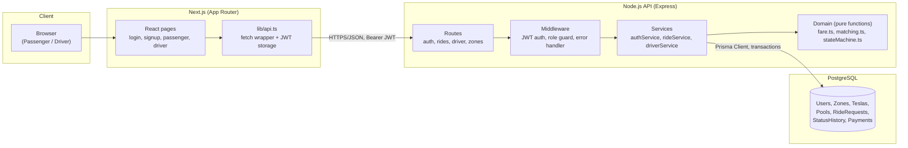
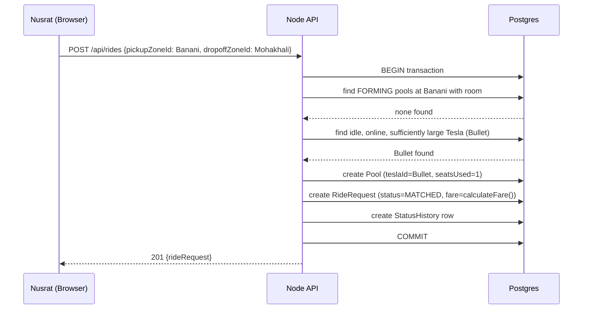

# Architecture

## Component diagram

## Why this shape

- **Browser -> Next.js -> Node API -> Postgres** is the exact chain required
  by Section 9. The frontend never talks to the database directly; every
  write goes through the API so business rules (capacity, fare, state
  transitions) are enforced in one place, not duplicated in the client.
- **Domain logic is separated from services.** `fare.ts`, `matching.ts`, and
  `stateMachine.ts` are pure functions with no database or HTTP dependency,
  which is what makes them unit-testable without a running Postgres
  instance (see `backend/src/__tests__`). Services (`rideService.ts`,
  `driverService.ts`) wire that pure logic to Prisma transactions and HTTP
  responses.
- **No microservices, queues, or caches.** At this scale (a few actors, an
  MVP evaluation) a single Express process and a single Postgres instance
  is the entire system. Section 9 explicitly penalizes adding Kafka/Redis/
  Kubernetes just to look advanced. The bonus doc (`scaling-bonus.md`)
  covers what changes if this genuinely had to serve 1M passengers.
- **Stateless JWT auth** means the API can be horizontally scaled later
  (Section on viral scale) without a shared session store - any instance
  can verify any token.

## Request lifecycle example (Nusrat requests a ride)

When Rafiq requests two minutes later with the same pickup zone, the first
`find FORMING pools` step finds Nusrat's pool, and the atomic
`updateMany(... WHERE seatsUsed + n <= capacity)` claims a seat instead of
opening a new pool - this is the pooling behavior in one sentence.
