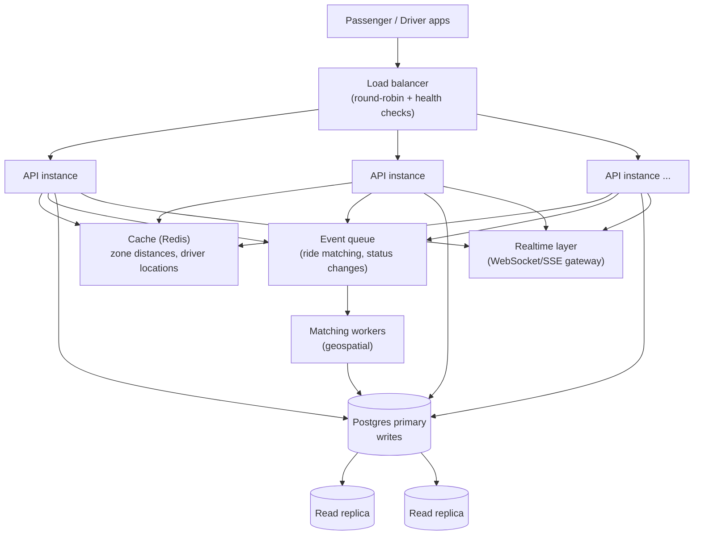

# Bonus: If Oi Tesla Goes Viral (1M passengers, 100k drivers)

Reasoning through scale without over-building the MVP (Section 9's "add
complexity only when there is a reason" still applies here - this is a
design exercise, not a build list).

- **Load balancing / horizontal scaling.** The API is already stateless
  (JWT, no server-side session), so it scales horizontally behind a load
  balancer with no code change - this is the direct payoff of that
  MVP-stage choice.
- **DB indexing / read replicas.** The schema already indexes the hot
  lookup paths (`Pool(teslaId, status)`, `RideRequest(passengerId)`,
  `RideRequest(status)`). At scale, reads (ride history, driver dashboards)
  move to replicas; only the seat-claim and status-transition writes hit
  the primary, which is the minimum surface that genuinely needs strong
  consistency.
- **Caching.** Zone/distance lookups are near-static and cache well
  (Redis, long TTL). Driver online/location state changes constantly and
  is a poor fit for the relational store at high write volume - it belongs
  in a fast key-value store (Redis geo commands or similar) with Postgres
  holding only the durable trip/payment record.
- **Geospatial search.** The MVP's zone-based matching (same pickup zone)
  stops being adequate once "zone" can't approximate "nearby enough" at
  city scale with 100k drivers - this is where a real geospatial index
  (PostGIS, or a dedicated geo service using H3/S2 cells) replaces the
  `ZoneDistance` lookup table, matching by proximity radius instead of
  exact zone equality.
- **Queues / events.** Ride requests, matches, and status transitions
  become events on a queue (e.g. a Kafka/SQS-style broker) so matching
  workers can process them asynchronously and independently of the
  request/response cycle, decoupling "accept the HTTP request" from
  "find and lock a Tesla," which is where contention concentrates.
- **Real-time communication.** Passenger/driver apps move from polling
  (`GET /api/rides/mine`) to a WebSocket or SSE gateway pushing status
  changes, cutting both latency and request volume.
- **Rate limiting & idempotency.** Public endpoints get per-user rate
  limits; ride-request and payment endpoints accept an idempotency key so
  a retried request (mobile network flake) can't double-create a ride or
  double-charge a fare.
- **DB contention on hot rows.** A single wildly popular pickup zone at
  rush hour is exactly the `Pool` row-locking pattern in
  `docs/concurrency.md`, magnified. Mitigations: shard `Pool` rows across
  more, smaller matching units (more, smaller effective zones), or move
  seat-claiming into the queue-based matcher so claims are serialized
  per-Tesla in a worker rather than contending on the DB row directly.
- **Observability.** Structured logs, request tracing (a request ID
  threaded through logs), and metrics on match latency, seat-claim
  conflict rate, and pool fill rate - the seat-claim conflict rate
  specifically is the metric that tells you when the current concurrency
  strategy is starting to strain.
- **Retry/failure strategy.** A losing seat-claim already falls back to
  "try the next pool / open a new one" (see `rideService.ts`); at scale
  this becomes an explicit retry-with-backoff inside the matching worker,
  with a max-retry fallback to REQUESTED (unmatched, waiting).
- **Security.** Rate limiting, input validation (already via `zod`),
  parameterized queries (already via Prisma), secrets in a managed vault
  rather than `.env` files, and moving from a single shared JWT secret to
  rotated, short-lived tokens with refresh.
- **Deployment strategy.** Blue/green or rolling deploys behind the load
  balancer, DB migrations run as a separate, backward-compatible step
  before the new API version is promoted (not `prisma migrate deploy` as
  part of container start, which is fine for this MVP's single instance
  but would race across many instances at scale).
